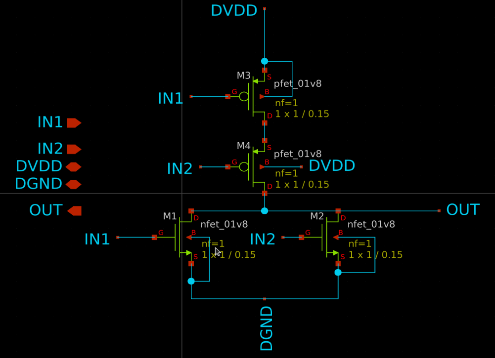
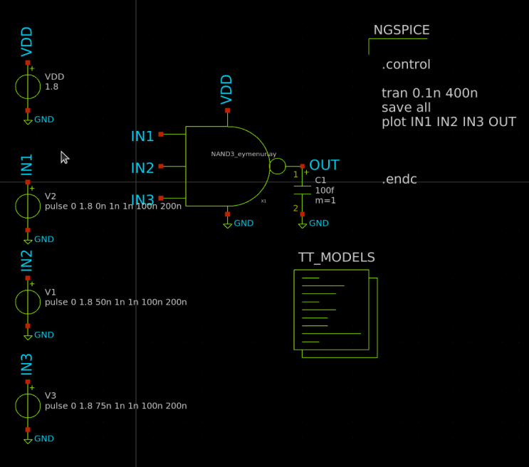
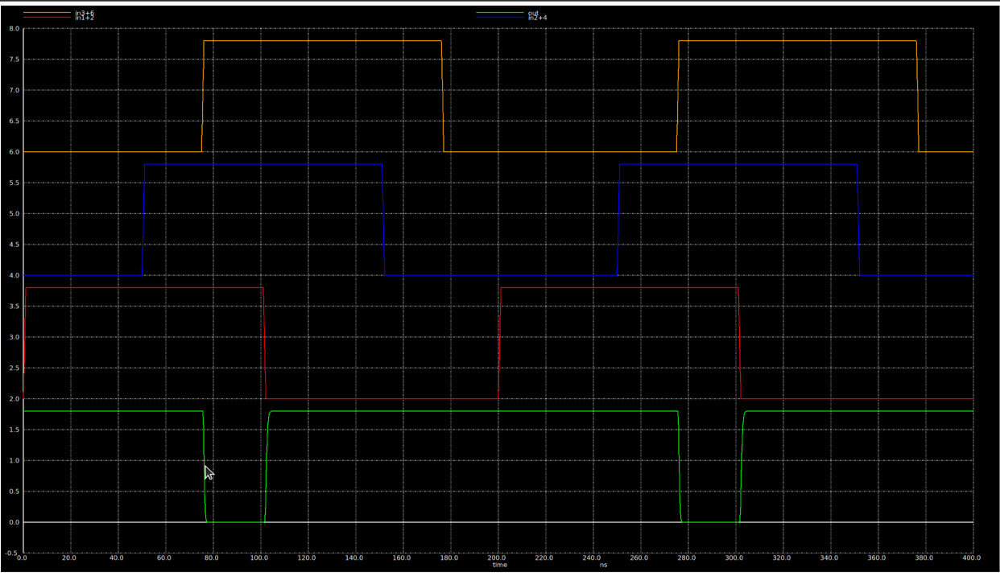
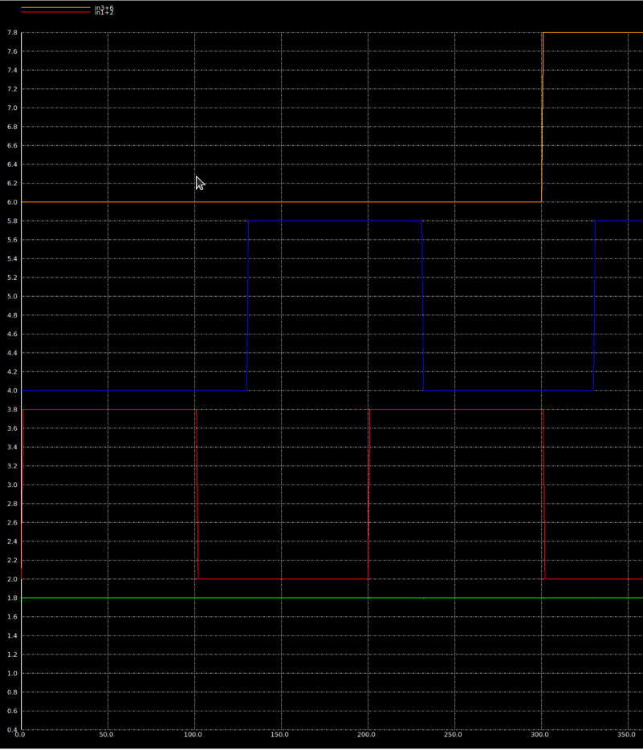
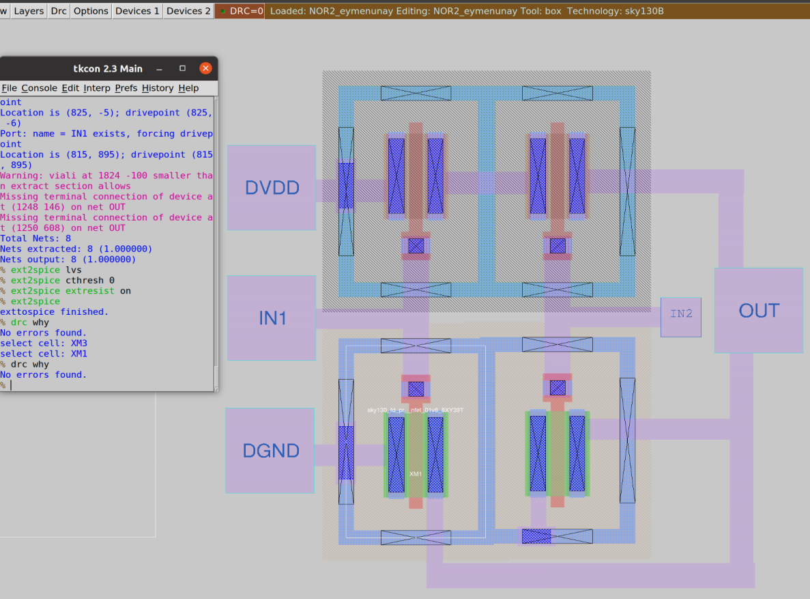
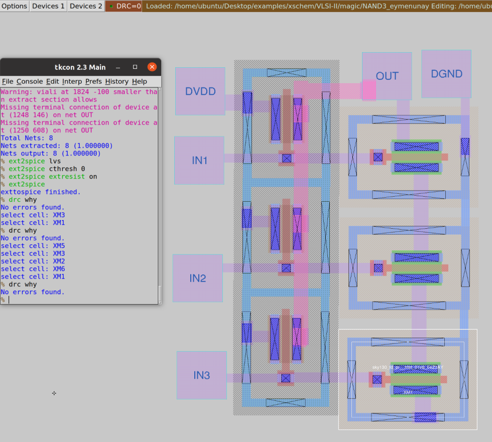
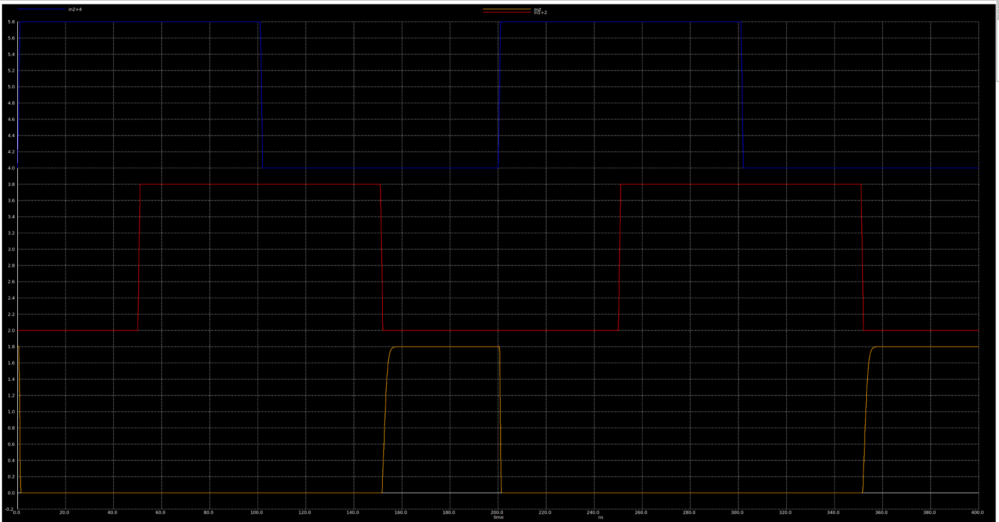
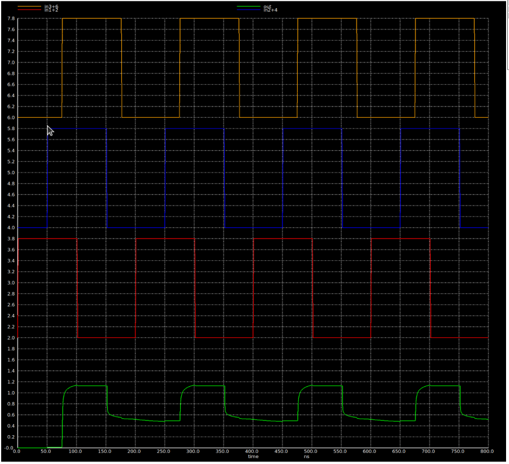

# Schematic

Skywater PDK is used in the design of NOR2 and NAND3 gates. As NMOS devices pull the output to GND, they have a negating effect on the output. NMOS devices were thought to provide the NOT of the boolean functions of the logic gates. To have an OR the NMOS transistors must be placed in parallel. Contrastly, PMOS counterparts should be connected in the contrasting topology which means in series for NOR2

## NOR2 
To have the boolean function  $f(p,q) = \overline{(p \vee q)}$ performed by CMOS transistor pairs, NMOS devices were thought of.   The NOT of the NOR function becomes OR for the NMOS devices, $\overline{f(p,q)} = (p \vee q)$. 



## NAND3
To have the boolean function  $f(p,q,r) = \overline{(p \wedge q \wedge r)}$ performed by CMOS transistor pairs, NMOS devices were thought first. The NOT of the NOR function becomes AND for the NMOS devices, $\overline{f(p,r)} = (p \wedge q \wedge r)$. 


### Symbols of NOR2 and NAND3


# Simulation Environment

## NOR2


| Time (ns) | {IN1, IN2} | OUT |
| --------- | ---------- | --- |
| 0         | 01         | 0   |
| 50        | 11         | 0   |
| 100       | 10         | 0   |
| 150       | 00         | 1   |

NOR2 gate takes the OR and NOT of its inputs as it can be seen from the waveform table it is matching the truth table of NOR.


## NAND3

Periods of pulses are changed to accomodate phase differences to have the most possible combinations of differing pulse values.




| Time (ns)        | {IN1, IN2, IN3} | OUT |
| ---------------- | --------------- | --- |
| 0                | 100             | 1   |
| 50               | 110             | 1   |
| 75               | 111             | 0   |
| 100              | 011             | 1   |
| 150              | 001             | 1   |
| 175              | 000             | 1   |
| 125 (Sim. below) | 010             | 1   |


This simulation misses the 010 input so that combination can be seen here.

NAND3 takes the AND and NOT of its inputs so to make the output 0 all of the inputs must be 1 at the same time. In all other cases the output is high.


# Layout
## NOR2



The size of this layout is 6.6x6.4 um accounting the pin sizes.


## NAND3


The size of this layout is 6x8um accounting the pins.

The sizes of both layouts are optimised to be under 10um in height and width according to the requirement. It is possible to further optimise it by removing the local interconnects and drawing them again around a batch of transistors. 


### LVS 

#### NOR2
```
Circuit 1 cell sky130_fd_pr__nfet_01v8 and Circuit 2 cell sky130_fd_pr__nfet_01v8 are black boxes.
Warning: Equate pins:  cell sky130_fd_pr__nfet_01v8 is a placeholder, treated as a black box.
Warning: Equate pins:  cell sky130_fd_pr__nfet_01v8 is a placeholder, treated as a black box.

Subcircuit pins:
Circuit 1: sky130_fd_pr__nfet_01v8         |Circuit 2: sky130_fd_pr__nfet_01v8         
-------------------------------------------|-------------------------------------------
1                                          |1                                          
2                                          |2                                          
3                                          |3                                          
4                                          |4                                          
---------------------------------------------------------------------------------------
Cell pin lists are equivalent.
Device classes sky130_fd_pr__nfet_01v8 and sky130_fd_pr__nfet_01v8 are equivalent.

Circuit 1 cell sky130_fd_pr__pfet_01v8 and Circuit 2 cell sky130_fd_pr__pfet_01v8 are black boxes.
Warning: Equate pins:  cell sky130_fd_pr__pfet_01v8 is a placeholder, treated as a black box.
Warning: Equate pins:  cell sky130_fd_pr__pfet_01v8 is a placeholder, treated as a black box.

Subcircuit pins:
Circuit 1: sky130_fd_pr__pfet_01v8         |Circuit 2: sky130_fd_pr__pfet_01v8         
-------------------------------------------|-------------------------------------------
1                                          |1                                          
2                                          |2                                          
3                                          |3                                          
4                                          |4                                          
---------------------------------------------------------------------------------------
Cell pin lists are equivalent.
Device classes sky130_fd_pr__pfet_01v8 and sky130_fd_pr__pfet_01v8 are equivalent.
Flattening unmatched subcell sky130_fd_pr__nfet_01v8_8XY39T in circuit NOR2_eymenunay (0)(1 instance)
Flattening unmatched subcell sky130_fd_pr__nfet_01v8_8XY3SE in circuit NOR2_eymenunay (0)(1 instance)
Flattening unmatched subcell sky130_fd_pr__pfet_01v8_MNYNRG in circuit NOR2_eymenunay (0)(1 instance)
Flattening unmatched subcell sky130_fd_pr__pfet_01v8_LG57AL in circuit NOR2_eymenunay (0)(1 instance)

Subcircuit summary:
Circuit 1: NOR2_eymenunay                  |Circuit 2: NOR2_eymenunay                  
-------------------------------------------|-------------------------------------------
sky130_fd_pr__nfet_01v8 (2)                |sky130_fd_pr__nfet_01v8 (2)                
sky130_fd_pr__pfet_01v8 (2)                |sky130_fd_pr__pfet_01v8 (2)                
Number of devices: 4                       |Number of devices: 4                       
Number of nets: 6                          |Number of nets: 6                          
---------------------------------------------------------------------------------------
Netlists match uniquely.

Subcircuit pins:
Circuit 1: NOR2_eymenunay                  |Circuit 2: NOR2_eymenunay                  
-------------------------------------------|-------------------------------------------
IN2                                        |IN2                                        
IN1                                        |IN1                                        
DGND                                       |DGND                                       
OUT                                        |OUT                                        
DVDD                                       |DVDD                                       
---------------------------------------------------------------------------------------
Cell pin lists are equivalent.
Device classes NOR2_eymenunay and NOR2_eymenunay are equivalent.

Final result: Circuits match uniquely.
.
```

#### NAND3

```

Circuit 1 cell sky130_fd_pr__nfet_01v8 and Circuit 2 cell sky130_fd_pr__nfet_01v8 are black boxes.
Warning: Equate pins:  cell sky130_fd_pr__nfet_01v8 is a placeholder, treated as a black box.
Warning: Equate pins:  cell sky130_fd_pr__nfet_01v8 is a placeholder, treated as a black box.

Subcircuit pins:
Circuit 1: sky130_fd_pr__nfet_01v8         |Circuit 2: sky130_fd_pr__nfet_01v8         
-------------------------------------------|-------------------------------------------
1                                          |1                                          
2                                          |2                                          
3                                          |3                                          
4                                          |4                                          
---------------------------------------------------------------------------------------
Cell pin lists are equivalent.
Device classes sky130_fd_pr__nfet_01v8 and sky130_fd_pr__nfet_01v8 are equivalent.

Circuit 1 cell sky130_fd_pr__pfet_01v8 and Circuit 2 cell sky130_fd_pr__pfet_01v8 are black boxes.
Warning: Equate pins:  cell sky130_fd_pr__pfet_01v8 is a placeholder, treated as a black box.
Warning: Equate pins:  cell sky130_fd_pr__pfet_01v8 is a placeholder, treated as a black box.

Subcircuit pins:
Circuit 1: sky130_fd_pr__pfet_01v8         |Circuit 2: sky130_fd_pr__pfet_01v8         
-------------------------------------------|-------------------------------------------
1                                          |1                                          
2                                          |2                                          
3                                          |3                                          
4                                          |4                                          
---------------------------------------------------------------------------------------
Cell pin lists are equivalent.
Device classes sky130_fd_pr__pfet_01v8 and sky130_fd_pr__pfet_01v8 are equivalent.
Flattening unmatched subcell sky130_fd_pr__nfet_01v8_64Z3AY in circuit NAND3_eymenunay (1)(3 instances)
Flattening unmatched subcell sky130_fd_pr__pfet_01v8_QDT3BL in circuit NAND3_eymenunay (1)(1 instance)
Flattening unmatched subcell sky130_fd_pr__pfet_01v8_BDT3BC in circuit NAND3_eymenunay (1)(1 instance)
Flattening unmatched subcell sky130_fd_pr__pfet_01v8_7HS3BC in circuit NAND3_eymenunay (1)(1 instance)

Subcircuit summary:
Circuit 1: NAND3_eymenunay                 |Circuit 2: NAND3_eymenunay                 
-------------------------------------------|-------------------------------------------
sky130_fd_pr__nfet_01v8 (3)                |sky130_fd_pr__nfet_01v8 (3)                
sky130_fd_pr__pfet_01v8 (3)                |sky130_fd_pr__pfet_01v8 (3)                
Number of devices: 6                       |Number of devices: 6                       
Number of nets: 8                          |Number of nets: 8                          
---------------------------------------------------------------------------------------
Netlists match uniquely.

Subcircuit pins:
Circuit 1: NAND3_eymenunay                 |Circuit 2: NAND3_eymenunay                 
-------------------------------------------|-------------------------------------------
DVDD                                       |DVDD                                       
IN3                                        |IN3                                        
IN1                                        |IN1                                        
IN2                                        |IN2                                        
DGND                                       |DGND                                       
OUT                                        |OUT                                        
---------------------------------------------------------------------------------------
Cell pin lists are equivalent.
Device classes NAND3_eymenunay and NAND3_eymenunay are equivalent.

Final result: Circuits match uniquely.
.
```

LVS is made until the design's device classes and pin lists match.


# Parasitic Extraction / Post Layout Simulation

## NOR2
The resulting waveform with parasitics:


It can be observed qualitatively that the rise time has increased. Looking closer to the output waveform:


The rise time can be calculated as time at 95% subtracted with time at 5% of final value.
The calculation results a time close to 4ns.

If we take a look at output of NOR2 gate without considering parasitics:

The rise time is close to 3ns in non-parasitic case.


## NAND3


The pull-down mechanism of the circuit is damaged completely with the introduction of parasitics. My estimation is that the series connected NMOS transistors have accumulated the parasitics effect further. Apparently the rise time also increased but it is not that significant compared to the inability to get to low voltage state. 

So the parasitics are significantly affecting performance of these devices
